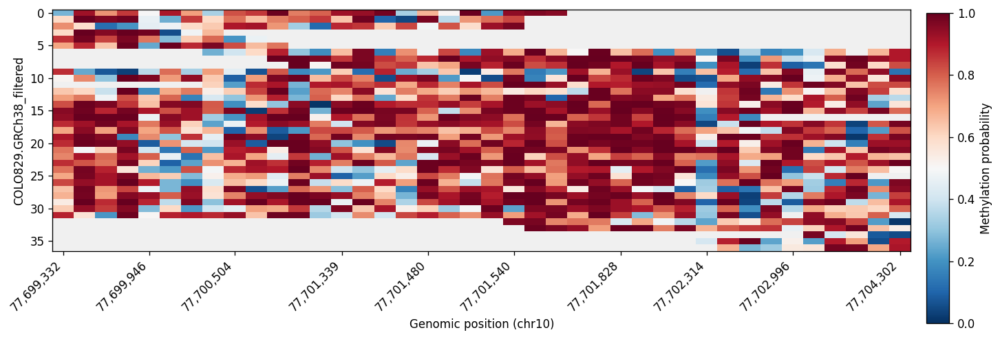
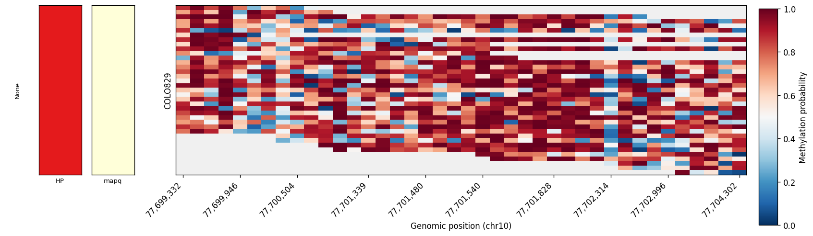
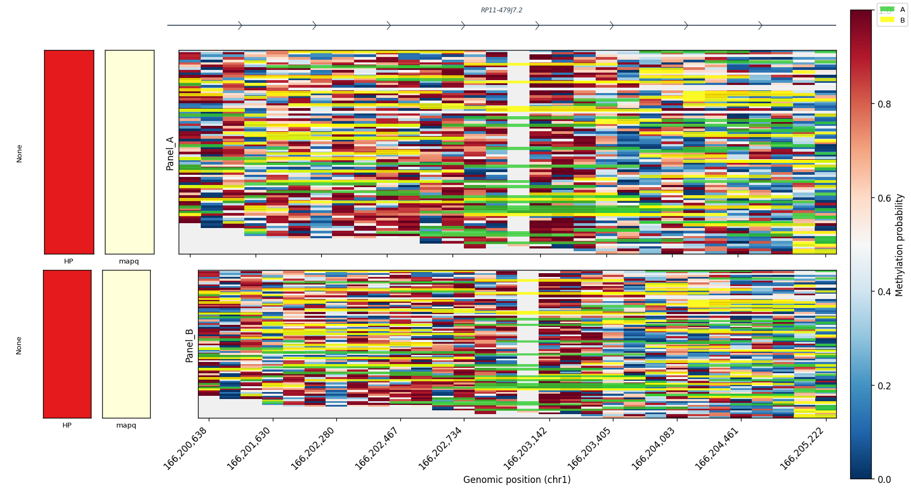

# cpgplotter

**Visualize read-level CpG methylation patterns from long-read sequencing data.**

cpgplotter creates publication-ready heatmaps of per-read CpG methylation probabilities from nanopore or PacBio BAM files. It plots methylation in **CpG coordinate space** -- equal spacing between CpGs regardless of genomic distance -- with support for multiple samples, per-read annotations, gene tracks, and flexible layouts.


*Single-sample methylation heatmap with reads ordered by hierarchical clustering of methylation patterns.*

## Features

- **CpG coordinate space** -- CpGs are equally spaced on the x-axis, revealing methylation patterns that genomic-space plots obscure
- **Multi-sample panels** -- Stack any number of BAMs on a shared coordinate system for direct comparison
- **Per-read annotations** -- Sort and color reads by haplotype, mapping quality, or any custom annotation
- **Interval overlays** -- Highlight sub-read regions of interest (FIRE peaks, accessible chromatin, CTCF footprints)
- **Gene annotation track** -- Display gene models from GTF files aligned to CpG space
- **Hierarchical clustering** -- Reads within each annotation group are ordered by methylation pattern similarity (Hellinger distance, Ward's method)
- **Reproducible** -- Dump the fully resolved config to YAML, replay it later for identical output
- **Dual interface** -- Full CLI for scripting and a Python API for notebooks and custom figures

## Installation

Requires Python 3.13+.

```bash
git clone https://github.com/tobybaker/cpgplotter.git
cd cpgplotter
pip install -e .
```

### Dependencies

cpgplotter depends on: `pysam`, `numpy`, `scipy`, `numba`, `polars`, `matplotlib`, `pydantic`, `click`, and `pyyaml`. These are installed automatically.

## Quick start

### Command line

```bash
# Single BAM, minimal
cpgplotter plot --bam tumor.bam --region chr7:1072064-1101499

# Compare two samples
cpgplotter plot \
  --bam Tumor:tumor.bam \
  --bam Normal:normal.bam \
  --region chr7:1072064-1101499

# Sort by haplotype with a side axis
cpgplotter plot \
  --bam tumor.bam \
  --region chr7:1072064-1101499 \
  --read-annotations haplotype:HP \
  --sort-by haplotype \
  --side-axes haplotype:qualitative:Set2
```

### Python API

```python
from cpgplotter import plot_methylation

# Simple single-sample plot
fig = plot_methylation(
    region="chr7:1072064-1101499",
    bams="tumor.bam",
)
fig.savefig("methylation.png")

# Multi-sample comparison with annotations
fig = plot_methylation(
    region="chr7:1072064-1101499",
    bams={"Tumor": "tumor.bam", "Normal": "normal.bam"},
    read_annotations={"haplotype": "HP"},
    sort_by=["haplotype"],
    side_axes={"haplotype": {"type": "qualitative", "palette": "Set2"}},
)
fig.savefig("comparison.pdf")
```

## Input requirements

### BAM files

BAM files must be **sorted and indexed** (`.bam` + `.bam.bai` or `.bam.csi`) and contain modified base information via the `MM` and `ML` tags ([SAM spec Section 1.7](https://samtools.github.io/hts-specs/SAMtags.pdf)). Only `C+m` (5-methylcytosine) modifications are considered. CpG positions are derived directly from the modified base calls -- no reference FASTA is needed.

Supported sequencing platforms:

- **Oxford Nanopore** -- basecalled with a modified-base model (e.g. Dorado `sup` with `5mCG_5hmCG`)
- **PacBio** -- HiFi reads with kinetic modification calls

### Genomic region

A single region in `chr:start-end` format (e.g. `chr7:1072064-1101499`). The tool is designed for small to moderate regions, typically up to ~50 kb.

## CpG coordinate space

cpgplotter plots methylation in **CpG coordinate space** rather than genomic coordinate space. Each CpG site gets equal width on the x-axis regardless of the (often highly variable) genomic distances between them. This makes methylation patterns across CpG islands, shores, and sparse regions directly comparable.

The shared `CpGIndex` object is constructed once from all input BAMs and passed to every renderer, guaranteeing exact vertical alignment across panels. Genomic coordinate tick labels are placed on the bottom axis for reference.

---

## CLI reference

```
cpgplotter plot [OPTIONS]
```

### Region and input

| Flag | Type | Description |
|------|------|-------------|
| `--region` | `TEXT` | **Required.** Genomic region, e.g. `chr7:1072064-1101499` |
| `--bam` | `TEXT` (repeatable) | BAM file as `label:path` or just `path`. Repeatable for multiple samples. Mutually exclusive with `--samples` |
| `--samples` | `PATH` | Sample sheet TSV (see [Sample sheet format](#sample-sheet)). Mutually exclusive with `--bam` |

When a `--bam` path is given without a label (e.g. `--bam tumor.bam`), the label is derived from the filename stem (`tumor`).

### Annotations

| Flag | Type | Description |
|------|------|-------------|
| `--read-annotations` | `TEXT` (repeatable) | Per-read scalar annotation. Either `label:BAM_TAG` to extract from the BAM (e.g. `haplotype:HP`, `mapq:mapq`) or a path to a TSV file |
| `--read-regions` | `PATH` (repeatable) | Per-read interval BED file for overlay rendering |

### Sorting and display

| Flag | Type | Default | Description |
|------|------|---------|-------------|
| `--sort-by` | `TEXT` | _(clustering)_ | Comma-separated annotation columns for read ordering. Qualitative columns define groups; quantitative columns order within groups. If omitted, reads are ordered by hierarchical clustering of methylation patterns |
| `--side-axes` | `TEXT` (repeatable) | _(none)_ | Side axis specification as `column:type:palette`. Type is `qualitative` or `quantitative`; palette is any matplotlib colormap name. Type and palette can be omitted for auto-inference |
| `--colormap` | `TEXT` | `RdBu_r` | Matplotlib colormap for methylation probabilities (0 = unmethylated, 1 = methylated) |
| `--panel-height-mode` | `uniform` or `proportional` | `uniform` | Whether panels have equal height or height proportional to read count |

### Filtering

| Flag | Type | Default | Description |
|------|------|---------|-------------|
| `--min-mapq` | `INT` | `0` | Minimum mapping quality. Reads below this threshold are excluded |
| `--max-reads` | `INT` | _(all)_ | Maximum reads per panel. If a sample has more reads, a random subset is taken |
| `--min-cpg-coverage` | `INT` | `3` | Minimum number of reads covering a CpG site for it to appear in the index |
| `--min-cpgs-per-read` | `INT` | `5` | Minimum CpG sites covered by a read for it to be included |
| `--nan-weight` | `FLOAT` | `0.5` | Weight for non-overlapping CpGs when computing clustering distance (0-1). Higher values push reads with different coverage patterns apart |

### Gene annotation

| Flag | Type | Default | Description |
|------|------|---------|-------------|
| `--gtf` | `PATH` | _(none)_ | GTF annotation file (`.gtf` or tabix-indexed `.gtf.gz`). When provided, a gene track is rendered above the heatmap panels |
| `--gene-types` | `TEXT` | `protein_coding` | Comma-separated list of gene biotypes to display, or `all` for everything |

### Output

| Flag | Type | Default | Description |
|------|------|---------|-------------|
| `-o`, `--output` | `PATH` | _(auto)_ | Output file path. Auto-generated from region and format if omitted |
| `--format` | `png`, `svg`, or `pdf` | `png` | Output format |
| `--figsize` | `FLOAT,FLOAT` | _(auto)_ | Figure width and height in inches, e.g. `14,8` |
| `--dpi` | `INT` | `150` | Output resolution in dots per inch |

### Reproducibility

| Flag | Type | Description |
|------|------|-------------|
| `--dump-config` | `PATH` | Save the fully resolved configuration (with all defaults) to a YAML file |
| `--config` | `PATH` | Load configuration from a YAML file. Overrides all other flags |

---

## Python API reference

### `plot_methylation()`

The high-level function for creating complete figures.

```python
from cpgplotter import plot_methylation

fig = plot_methylation(
    region: str,                                    # Required: "chr:start-end"
    bams: dict[str, str | Path] | str | Path,       # Required: BAM path(s)
    read_annotations: dict[str, str] | str | Path = None,
    read_regions: str | Path = None,
    sort_by: list[str] = None,
    side_axes: dict[str, dict] = None,
    colormap: str = "RdBu_r",
    panel_height_mode: str = "uniform",
    max_reads: int = None,
    min_mapq: int = 0,
    min_cpg_coverage: int = 3,
    min_cpgs_per_read: int = 5,
    nan_weight: float = 0.5,
    gtf: str | Path = None,
    gene_types: list[str] = None,
    figsize: tuple[float, float] = None,
    output: str | Path = None,
    output_format: str = "png",
    dpi: int = 150,
) -> matplotlib.figure.Figure
```

**Parameters:**

| Parameter | Type | Default | Description |
|-----------|------|---------|-------------|
| `region` | `str` | _(required)_ | Genomic region, e.g. `"chr7:1072064-1101499"` |
| `bams` | `dict`, `str`, or `Path` | _(required)_ | Single BAM path, or `{label: path}` dict for multiple |
| `read_annotations` | `dict`, `str`, `Path`, or `None` | `None` | `{label: BAM_tag}` dict or TSV path |
| `read_regions` | `str`, `Path`, or `None` | `None` | Per-read interval BED path |
| `sort_by` | `list[str]` or `None` | `None` | Annotation columns for read ordering |
| `side_axes` | `dict` or `None` | `None` | `{column: {"type": ..., "palette": ...}}` |
| `colormap` | `str` | `"RdBu_r"` | Methylation colormap |
| `panel_height_mode` | `str` | `"uniform"` | `"uniform"` or `"proportional"` |
| `max_reads` | `int` or `None` | `None` | Max reads per sample |
| `min_mapq` | `int` | `0` | Minimum mapping quality |
| `min_cpg_coverage` | `int` | `3` | Min reads per CpG for index inclusion |
| `min_cpgs_per_read` | `int` | `5` | Min CpGs per read for inclusion |
| `nan_weight` | `float` | `0.5` | Clustering distance weight for missing data |
| `gtf` | `str`, `Path`, or `None` | `None` | GTF annotation file path |
| `gene_types` | `list[str]` or `None` | `None` | Gene biotypes to show (default: `["protein_coding"]`) |
| `figsize` | `tuple` or `None` | `None` | `(width, height)` in inches |
| `output` | `str`, `Path`, or `None` | `None` | Save path (returns figure without saving if `None`) |
| `output_format` | `str` | `"png"` | `"png"`, `"svg"`, or `"pdf"` |
| `dpi` | `int` | `150` | Output resolution |

**Returns:** `matplotlib.figure.Figure`

### `plot_methylation_from_config()`

Create a plot from a `PlotConfig` object or YAML file.

```python
from cpgplotter import plot_methylation_from_config

# From a previously dumped config file
fig = plot_methylation_from_config("saved_config.yaml")

# From a PlotConfig object
from cpgplotter import PlotConfig, SampleSpec
config = PlotConfig(
    region="chr7:1072064-1101499",
    samples=[SampleSpec(name="Tumor", bam="tumor.bam")],
)
fig = plot_methylation_from_config(config)
```

### Component-level API

For custom multi-panel figures and fine-grained control, use the individual components directly. All are importable from `cpgplotter`:

```python
from cpgplotter import (
    CpGIndex,
    extract_methylation,
    ReadAnnotations,
    ReadIntervals,
    render_heatmap,
    create_panel_layout,
    add_genomic_ticks,
    load_gene_annotations,
    render_gene_track,
)
```

**Example: custom two-panel figure**

```python
import matplotlib.pyplot as plt
from cpgplotter import CpGIndex, extract_methylation, render_heatmap, add_genomic_ticks

region = "chr7:1072064-1101499"

# Build shared coordinate system from both BAMs
index = CpGIndex(region=region, bam_path=["tumor.bam", "normal.bam"])

# Extract methylation matrices
tumor = extract_methylation("tumor.bam", cpg_index=index)
normal = extract_methylation("normal.bam", cpg_index=index)

# Render on custom axes
fig, axes = plt.subplots(2, 1, sharex=True, figsize=(14, 8))
render_heatmap(tumor.matrix, ax=axes[0])
render_heatmap(normal.matrix, ax=axes[1])

# Add genomic coordinate ticks to the bottom axis
add_genomic_ticks(axes[1], index)

fig.savefig("custom_figure.pdf")
```

---

## Gallery

### Per-read annotations

Sort reads by haplotype and mapping quality, with color-coded side axes:



### Full-featured multi-panel

Combine gene tracks, haplotype and mapq annotations, interval overlays, and multi-panel layout:



---

## Examples

### Basic single-sample plot

```bash
cpgplotter plot \
  --bam tumor.bam \
  --region chr7:1072064-1101499 \
  -o tumor_methylation.png
```

### Multi-sample comparison

```bash
cpgplotter plot \
  --bam Tumor:tumor.bam \
  --bam Normal:normal.bam \
  --region chr7:1072064-1101499 \
  --format pdf \
  -o comparison.pdf
```

### Haplotype-resolved methylation

Sort reads by haplotype (from the BAM `HP` tag) and display a haplotype color bar:

```bash
cpgplotter plot \
  --bam tumor.bam \
  --region chr7:1072064-1101499 \
  --read-annotations haplotype:HP \
  --sort-by haplotype \
  --side-axes haplotype:qualitative:Set2 \
  -o haplotype_resolved.png
```

### Multiple annotations

Sort first by haplotype (qualitative grouping), then by mapping quality (quantitative ordering within groups):

```bash
cpgplotter plot \
  --bam tumor.bam \
  --region chr7:1072064-1101499 \
  --read-annotations haplotype:HP \
  --read-annotations mapq:mapq \
  --sort-by haplotype,mapq \
  --side-axes haplotype:qualitative:Set2 \
  --side-axes mapq:quantitative:viridis \
  -o multi_annotation.png
```

### Annotations from a TSV file

When annotations come from an external source rather than BAM tags:

```bash
cpgplotter plot \
  --bam tumor.bam \
  --region chr7:1072064-1101499 \
  --read-annotations annotations.tsv \
  --sort-by cluster \
  --side-axes cluster:qualitative
```

The TSV format:

```
read_name	cluster	score
read001	A	0.95
read002	B	0.82
read003	A	0.91
```

### Interval overlays

Highlight sub-read regions of interest (e.g. FIRE peaks):

```bash
cpgplotter plot \
  --bam tumor.bam \
  --region chr7:1072064-1101499 \
  --read-regions fire_peaks.bed \
  -o with_overlays.png
```

### Proportional panel heights

When samples have very different read counts, make panel heights proportional:

```bash
cpgplotter plot \
  --bam HighCov:high_coverage.bam \
  --bam LowCov:low_coverage.bam \
  --region chr7:1072064-1101499 \
  --panel-height-mode proportional \
  -o proportional.png
```

### High-resolution output

```bash
cpgplotter plot \
  --bam tumor.bam \
  --region chr7:1072064-1101499 \
  --figsize 16,10 \
  --dpi 300 \
  --format pdf \
  -o publication_figure.pdf
```

### Full-featured example

```bash
cpgplotter plot \
  --bam Tumor:tumor.bam \
  --bam Normal:normal.bam \
  --region chr7:1072064-1101499 \
  --read-annotations haplotype:HP \
  --read-annotations mapq:mapq \
  --read-regions fire_peaks.bed \
  --sort-by haplotype \
  --side-axes haplotype:qualitative:Set2 \
  --side-axes mapq:quantitative:viridis \
  --gtf gencode.v44.annotation.gtf.gz \
  --min-mapq 20 \
  --max-reads 500 \
  --colormap RdBu_r \
  --figsize 16,10 \
  --dpi 300 \
  --format pdf \
  --dump-config experiment_config.yaml \
  -o full_figure.pdf
```

### Sample sheet for many samples

For experiments with many samples, use a sample sheet:

```bash
cpgplotter plot \
  --samples experiment.tsv \
  --region chr7:1072064-1101499 \
  --sort-by haplotype \
  -o multi_sample.png
```

### Config replay

Save and replay a configuration for reproducibility:

```bash
# Save the resolved config
cpgplotter plot \
  --bam tumor.bam \
  --region chr7:1072064-1101499 \
  --read-annotations haplotype:HP \
  --sort-by haplotype \
  --dump-config my_config.yaml

# Replay later with identical settings
cpgplotter plot --config my_config.yaml -o reproduced.png
```

---

## File formats

### Sample sheet

A tab-separated file for specifying multiple samples. Used with `--samples`.

```
sample_name	bam_path	color	read_annotations	read_regions
Tumor_Rep1	/data/tumor_r1.bam	#FC766A	annot_r1.tsv	peaks_r1.bed
Tumor_Rep2	/data/tumor_r2.bam	#FC766A	.	peaks_r2.bed
Normal	/data/normal.bam	#184A45	.	.
```

| Column | Required | Description |
|--------|----------|-------------|
| `sample_name` | Yes | Label used in plot panels |
| `bam_path` | Yes | Path to sorted, indexed BAM |
| `color` | No | Hex color for this sample |
| `read_annotations` | No | Path to per-read annotation TSV (`.` for none) |
| `read_regions` | No | Path to per-read interval BED (`.` for none) |

Additional columns beyond these five are stored as sample-level metadata.

### Per-read annotation TSV

A tab-separated file mapping read names to annotation values. Used with `--read-annotations`.

```
read_name	haplotype	mapq	cluster
read001	H1	32	A
read002	H2	28	B
read003	H1	35	A
```

- First column must be `read_name`
- Subsequent columns are annotation fields
- Column types are inferred: integers and floats are quantitative, strings are qualitative
- Type inference can be overridden via the Python API

### Per-read interval BED

A BED-like tab-separated file defining sub-read regions of interest. Used with `--read-regions`.

```
read_name	start	end	label	score
read001	1002500	1002800	FIRE	0.95
read001	1003100	1003400	FIRE	0.87
read002	1002600	1002900	FIRE	0.91
read003	1003000	1003500	CTCF	0.78
```

| Column | Required | Description |
|--------|----------|-------------|
| `read_name` | Yes | Must match read names in the BAM |
| `start` | Yes | Interval start (0-based, genomic coordinates) |
| `end` | Yes | Interval end (exclusive, genomic coordinates) |
| `label` | No | Category label -- different labels get different overlay colors |
| `score` | No | Numeric score -- can modulate overlay opacity |

Coordinates are in genomic space; cpgplotter transforms them to CpG space internally.

---

## How read ordering works

Reads are ordered along the y-axis using a combination of annotation-based sorting and methylation-pattern clustering:

1. **Qualitative annotations** (e.g. haplotype) define groups. All reads sharing the same value are placed together.
2. **Quantitative annotations** (e.g. mapping quality) provide a secondary numeric ordering within groups.
3. **Hierarchical clustering** orders reads within each group when no quantitative annotation is specified. Pairwise distances use **Hellinger distance** between methylation probability vectors (considering only CpGs covered by both reads). Non-overlapping CpGs contribute a configurable penalty (`--nan-weight`). Clustering uses **Ward's method**.
4. If no annotations are specified at all, all reads are ordered purely by hierarchical clustering.

Specify the ordering with `--sort-by`:

```bash
# Group by haplotype, then order within groups by clustering
--sort-by haplotype

# Group by haplotype, then order by mapq within groups
--sort-by haplotype,mapq
```

